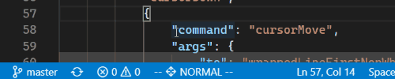
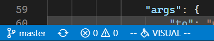
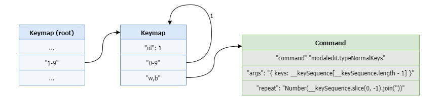
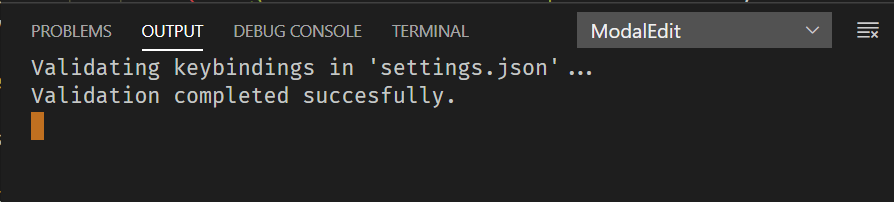
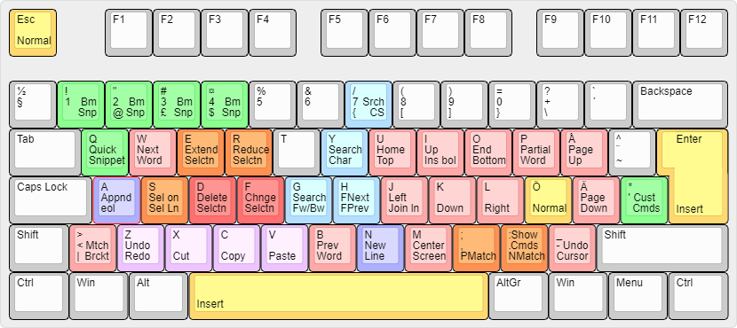
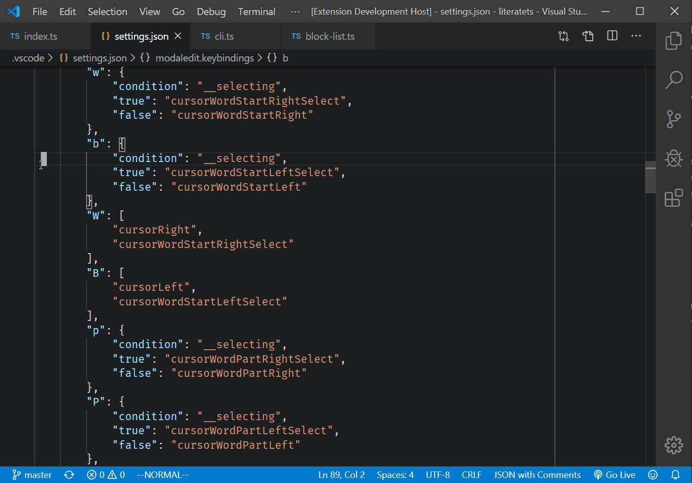
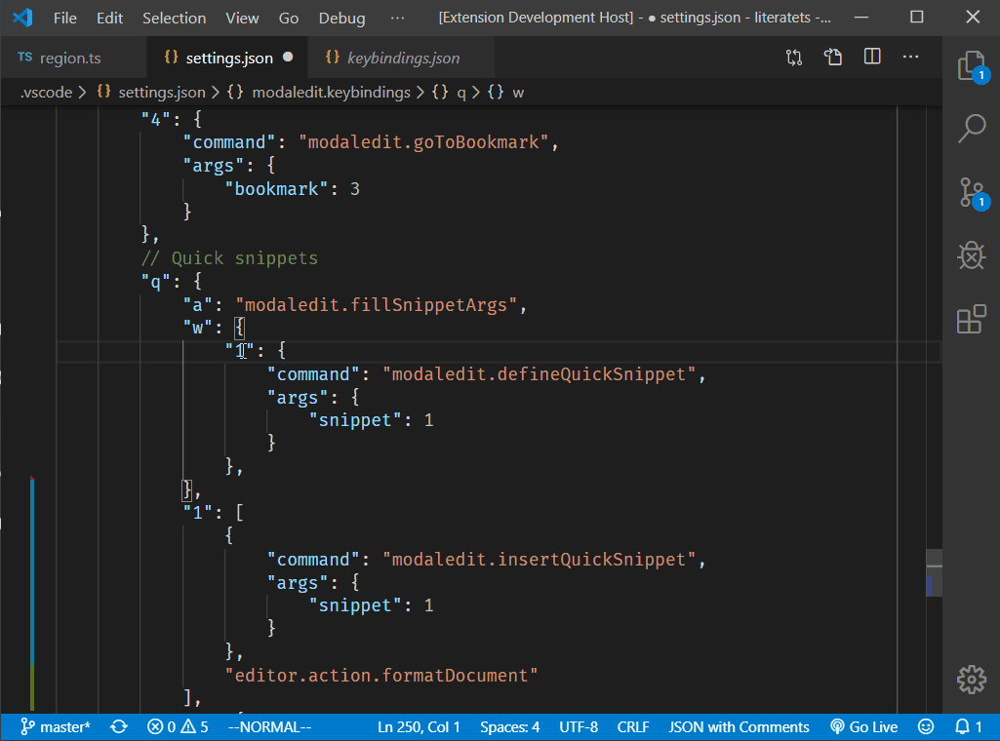

# Modal Editing in VS Code

ModalEdit is a simple but powerful extension that adds configurable "normal"
mode to VS Code. The most prominent [modal editor][1] is [Vim][2], which also 
inspired the development of ModalEdit. It includes Vim commands as presets
you can import, but ModalEdit's true power comes with its configurability. You 
can emulate existing editors like Vim or [Kakoune][8] or build your keyboard 
layout from ground up and add exactly the features you need.  

As in Vim, the goal of the extension is to save your keystrokes and make 
editing as efficient as possible. Unlike most Vim emulators, ModalEdit leverages 
the built-in features of VS Code. You define your keybindings using commands 
provided by VS Code and other extensions. You can build complex operations by 
arranging commands into sequences. You can define conditional commands that do 
different things based on editor state. Also, you can map these commands to 
arbitrarily long keyboard sequences.

> Version 2.0 is the latest major release, and it contains many improvements
> and new features that make ModalEdit more robust and flexible than before.
> See the [change log][12] for full list of enhancements and changes in the
> functionality.

## Getting Started

When extension is installed text documents will open in normal mode. The 
current mode is shown in the status bar. You can switch between modes by
clicking the pane in the status bar.



In normal mode keys don't output characters but invoke commands. You can 
specify these commands in the `settings.json` file. To edit your user-level 
settings file, open command palette with `Ctrl+Shift+P` and look up command 
**Preferences: Open Settings (JSON)**. If you want the configuration to be 
project specific, edit the `settings.json` that is located in the `.vscode` 
directory under your project directory. 

> You might want to skip to the [tutorial][9], if you prefer learning by 
> example. If you want to start with Vim keybindings, you'll find the 
> instructions [here][14]. Otherwise keep reading this document.

To define the key mappings used in normal mode, add a property named 
`modaledit.keybindings`. You should define at least one binding that will switch 
the editor to the *insert mode*, which is the same as VS Code's default mode.
```js
"modaledit.keybindings": {
    "i": "modaledit.enterInsert"
}
```
When you save the `settings.json` file, keybindings take effect immediately.

ModalEdit adds a regular VS Code keyboard shortcut for `Esc` to return back to
normal mode. If you wish, you can remap this command to another key by
pressing `Ctrl+K Ctrl+S`. 

### Selections/Visual Mode

ModalEdit does not have a separate selection/visual mode as Vim has. It is
possible to select text both in normal mode and insert mode. However, since it 
is typical that commands in normal have different behavior when selection is 
active, the status bar text changes to indicate that. You can change the text 
shown in status bar using [configuration parameters](#changing-status-bar)



ModalEdit defines a new command `modaledit.toggleSelection` which allows
you to start selecting text in normal mode without holding down the shift key.
This imitates Vim's visual mode.

## Configuration

You can define the normal mode commands in four different ways. It is also
possible to combine them freely.

### Single Command

The simplest way is to map a key to a single command. This has the format:
```js
"<key>": "<command>"
```
The `<key>` needs to be a single character and `<command>` any valid VS Code
command. You can see the list of all of the available commands by opening
global settings with command **Preferences: Open Default Keyboard Shortcuts (JSON)**.

The example in the previous section maps the `i` key to the
`modaledit.enterInsert` command.

### Commands with Arguments

Some [commands][6] take arguments. For example `cursorMove` which allows you
to specify which direction and how much cursor moves. These commands can be
executed by defining an object with prefined properties:
```js
"<key>":  {
    "command": "<command>",
    "args": { ... } | "{ ... }"
    "repeat": number | "<JS expression>"
}
```
The `<command>` is again a valid VS Code command. The `args` property contains 
whatever arguments the command takes. It can be specified as a JSON object
or as a string. If the value of the `args` property is a string, ModalEdit 
treats it as a JavaScript expression. It evaluates the expression and passes the 
result to the command. The following variables can be used inside expression 
strings:

| Variable        | Type       | Description 
| --------------- | ---------- | -------------------------------------------------
| `__file`        | `string`   | The file name of the document that is edited.
| `__line`        | `number`   | The line number where the cursor is currently on.
| `__col`         | `number`   | The column number where the cursor is currently on.
| `__char`        | `string`   | The character under the cursor.
| `__selection`   | `string`   | Currently selected text.
| `__selecting`   | `boolean`  | Flag that indicates whether selection is active.
| `__keySequence` | `string[]` | Array of keys that were pressed to invoke the command. 
| `__keys`        | `string[]` | Alias to the `__keySequence` variable.
| `__rkeys`       | `string[]` | Contains the `__keys` array reversed. This is handy when you want to access the last characters of the array as they will be first in `__rkeys`.
| `__cmd`         | `string`   | Containst the `__keys` array joined together to a string. Now you don't have to do this explicitly in you expressions. 
| `__rcmd`        | `string`   | Containst the `__rkeys` array joined together to a string.

The `repeat` property allows you to run the command multiple times. If the value
of the property is a number, it directly determines the repetition count. If it 
is a string, ModalEdit evaluates it as JS expression and checks if the result is 
a number. In that case the returned number is used as the repeat count. Note 
that numbers smaller than 1 will be ignored, and the command is always run at 
least once.

If returned value is not a number, the expression is treated as a condition that 
is evaluated after the command has run. The command is repeated as long as the 
expression returns a truthy value.

Below is an example that maps key `o` to a command that moves the cursor to the 
end of line. It also selects the jumped range, if we have selection active.
```js
"o": {
    "command": "cursorMove",
    "args": "{ to: 'wrappedLineEnd', select: __selecting }"
},
```

### Sequence of Commands

To construct more complex operations consisting of multiple steps, you can 
define command sequences. Commands in a sequence will be run one after another. 
A sequence is defined as an array.
```js
"<key>": [ <command1>, <command2>, ... ]
```
In above, `<command>` can assume any of the supported forms: single command,
one with arguments, or conditional command (see below).

The next example maps the `f` key to a command sequence that first deletes the
selected text and then switch to insert mode. It corresponds to the `c` command 
in Vim.
```js
"f": [
    "deleteRight",
    "modaledit.enterInsert"
],
```

### Conditional Commands

For even more complex scenarios, you can define commands that run different 
commands depending on a specified condition. The most common use case for this 
is to run a different command when selection is active. The format of a 
conditional commands is:
```js
"<key>":  {
    "condition": "<condition>",
    "<result1>": <command1>,
    "<result2>": <command2>,
    ...
}
```
Here `<condition>` can be any valid JavaScript expression. You can use 
variables listed in the "Commands with Arguments" section in the expression. If 
the expression evaluates to `<result1>`, `<command1>` will be executed, if to 
`<result2>`, `<command2>` will be run, and so forth. If none of the defined
properties match the expression result, nothing is done. Commands can be of any 
kind: a single command, sequence, or command with arguments. 

Below is an example that moves cursor one word forward with `w` key. We use
the `__selecting` variable to determine if a selection is active. If so, we 
extend the selection using `cursorWordStartRightSelect` command, otherwise we 
just jump to next word with `cursorWordStartRight`.
```js
"w": {
    "condition": "__selecting",
    "true": "cursorWordStartRightSelect",
    "false": "cursorWordStartRight"
},
```

### Binding Key Sequences

When you want to define a multi-key sequence, nest the key bindings. You can 
define a two key command using the following format.
```js
"<key1>": {
    "<key2>": <command>
},
```
Again, the `<command>` can be in any of the forms described above. To invoke
the command you first press `<key1>` in normal mode followed by `<key2>`.

The example below defines two commands that are bound to key sequences `g - f`
(search forwards) and `g - b` (search backwards).
```js
"g": {
    "f": {
        "command": "modaledit.search",
        "args": {}
    },
    "b": 
        "command": "modaledit.search",
        "args": {
            "backwards": true
        }
    }
}
```

### Defining Recursive Keymaps

Version 1.5 of ModalEdit introduced the possibility to create recursive keymaps.
With this feature you can define arbitrarily long keyboard sequences. This is
useful, for example, for creating commands that you can repeat by entering first
a number followed by a command key. Keymaps got two new features to enable this
functionality.

#### Key Ranges

You can add multiple characters to a keybinding comma `,` and dash `-`. For
example, `a,b` bind both `a` and `b` to the same action. You can also add ranges
like any numeric character `0-9`. The ASCII code of the first character must be 
smaller than the second one's. You can also combine these notations; for
instance, range `a,d-f` maps keys `a`, `d`, `e`, and `f` to a same action.

#### Keymap IDs

By giving keymap a numeric ID, you can refer to it in another (or same) keymap.
With key ranges, this allows you to create a binding that can take theoretically
infinitely long key sequence. The example below shows how you can define 
commands like `3w` that moves the cursor forward by three words. First we define
the commands that moves or select the previous/next word (with keys `b` and `w`), 
and then we create a binding that matches a positive number using key ranges and 
a recursive keymap. We also use the 
[`modaledit.typeNormalKeys` command](#invoking-key-bindings) to invoke the
existing key bindings and the [`repeat` property](#commands-with-arguments) to
repeat the command.
```js
        "w": {
            "condition": "__selecting",
            "true": "cursorWordStartRightSelect",
            "false": "cursorWordStartRight"
        },
        "b": {
            "condition": "__selecting",
            "true": "cursorWordStartLeftSelect",
            "false": "cursorWordStartLeft"
        },
        "1-9": {
            "id": 1,
            "help": "Enter count followed by [w, b]",
            "0-9": 1,
            "w,b": {
                "command": "modaledit.typeNormalKeys",
                "args": "{ keys: __rkeys[0] }",
                "repeat": "Number(__keys.slice(0, -1).join(''))"
            }
        }
```
We give the keymap attached to key range `1-9` the `id` of 1. When that keymap 
is active pressing key `0-9` will "jump" back to the same keymap. That is 
designated by the number `1` in the key binding. Only when the user presses 
some other key we get out of this keymap. If the user presses `w` or `b`, we 
run the command bound to the respective key. We get the repetition count by 
slicing the all but last character from the `__keys` array and converting that 
to a number. The command key is the last item of the `__keys` array. We can
access it more easily using the reversed `__rkeys` array. The item is first in
that array. 

The picture below illustrates how keymap and command objects are stored in 
memory.



It is also possible to jump to another keymap, which enables even more 
complicated keyboard sequences. The only restriction is that you can only jump 
to a key binding which is already defined. I.e. you cannot refer to an ID of a 
keymap that appears later in the configuration.

> To better understand how keymaps work behind the scenes check the source
> [documentation][10]. 

Another new feature used in the example above is the optional `help` property 
in the keymap. The contents of the property is shown in the status bar when the 
keymap is active. It makes using long keyboard sequences easier by providing a 
hint what keys you can press next.

### Keybindings in Selection/Visual Mode

ModalEdit 2.0 adds a new configuration section called `selectbidings` that has
the same structure as the `keybindings` section. With it you can now map keys
that act as the lead key of a normal mode sequence to run a commands when 
pressed in visual mode. 

For example, you might want the `d` key to be the leader key for sequence 
"delete word" `dw` in normal mode, but in selection mode `d` should delete the selection 
without expecting any following keys. Previously it was not possible to define 
this behavior, but now you can do it with `selectbindings`. 

`selectbindings` section is always checked first when ModalEdit looks for a 
mapping for a keypress. If there is no binding defined in `selectbindings` 
then it checks the `keybindings` section. Note that you can still define normal
mode commands that work differently when selection is active. You can use either 
a conditional or parameterized command to check the `__selecting` flag, and 
perform a different action based on that.

### Debugging Keybindings

If you are not sure that your bindings are correct, check the ModalEdit's
output log. You can find it by opening **View - Output** and then choosing the
**ModalEdit** from the drop-down menu. Errors in configuration will be reported 
there. If your configuration is ok, you should see the following message. 



### Changing Cursors

You can set the cursor shape shown in each mode by changing the following 
settings. 

| Setting               | Default       | Description
| --------------------- | ------------- | -------------------------------------
| `insertCursorStyle`   | `line`        | Cursor shown in insert mode.
| `normalCursorStyle`   | `block`       | Cursor shown in normal mode.
| `searchCursorStyle`   | `underline`   | Cursor shown when incremental search is on.
| `selectCursorStyle`   | `line-thin`   | Cursor shown when selection is active in normal mode.

The possible values are:

- `block`
- `block-outline`
- `line`
- `line-thin`
- `underline`
- `underline-thin`

### Changing Status Bar

With version 2.0, you can also change the text shown in status bar in each mode
along with the text color. Note that you can add icons in the text by using
syntax `$(icon-name)` where `icon-name` is a valid name from the gallery of
[built-in icons][15].

The color of the status text is specified in HTML format, such as `#ffeeff`, 
`cyan`, or `rgb(50, 50, 50)`. By default these colors are not defined, and thus
they are same as the rest of text in the status bar.

| Setting            | Default                   | Description
| ------------------ | ------------------------- | -------------------------------------
| `insertStatusText` | `-- $(edit) INSERT --`    | Status text shown in insert mode
| `normalStatusText` | `-- $(move) NORMAL --`    | Status text shown in normal mode
| `searchStatusText` | `$(search) SEARCH`        | Status text shown when search is active
| `selectStatusText` | `-- $(paintcan) VISUAL --`| Status text shown when selection is active in normal mode
| `insertStatusColor`| `undefined`               | Status text color in insert mode
| `normalStatusColor`| `undefined`               | Status text color in normal mode
| `searchStatusColor`| `undefined`               | Status text color when search is active
| `selectStatusColor`| `undefined`               | Status text color when selection is active in normal mode

### Start in Normal Mode

If you want VS Code to be in insert mode when it starts, set the 
`startInNormalMode` setting to `false`. By default, editor is in normal mode
when you open it.

### Example Configurations

You can find example key bindings [here][7]. These are my own settings. The 
cheat sheet for my keyboard layout is shown below. I have created it in 
<http://www.keyboard-layout-editor.com/>. Please note that my keyboard layout 
is Finnish, so the non-alphanumeric keys might be in strange places.



As you can see, I haven't followed Vim conventions but rather tailored the 
keyboard layout according to my own preferences. I encourage you to do the same. 

In general, you should not try to convert VS Code into a Vim clone. The editing
philosophies of Vim and VS Code are quite dissimilar. Targets of Vim operations
are defined with special range commands, whereas VS Code's commands operate on 
selected text. For example, to delete a word in Vim, you first press `d` to 
delete and then `w` for word. In VS Code you first select the word (with `W` or 
`e` key in my configuration) then you delete the selection with `d` key.

To better understand the difference, check out [Kakoune editor's documentation][8]. 
ModalEdit extends VS Code with normal mode editing, so you have more or less 
the same capabilities as in Kakoune.

## Additional VS Code Commands

ModalEdit adds few useful commands to VS Code's repertoire. They help you
create more Vim-like workflow for searching and navigation.

### Switching between Modes

Use the following commands to change the current editor mode. None of the 
commands require any arguments.

| Command                     | Description
| --------------------------- | ----------------------------------------------
| `modaledit.toggle`          | Toggles between modes
| `modaledit.enterNormal`     | Switches to normal mode
| `modaledit.enterInsert`     | Switches to insert mode
| `modaledit.toggleSelection` | Toggles selection mode on or off. Selection mode is implicitly on whenever editor has text selected
| `modaledit.enableSelection` | Turn selection mode on.
| `modaledit.cancelSelection` | Cancel selection mode and clear selection.
| `modaledit.resetSelection`  | Cancel selection mode and clear selection, but keep multiple cursors

### Incremental Search

The standard search functionality in VS Code is quite clunky as it opens a 
dialog which takes you out of the editor. To achieve more fluid searching 
experience ModalEdit provides incremental search commands that mimic Vim's 
corresponding operations.

> There are lot of new parameters in the `search` command that were added in 
> version 2.0. Specifically, `typeAfter...` and `typeBefore...` arguments might 
> seem odd at first glance. Please see the [change log](CHANGELOG.html) to 
> understand the rationale why they are needed.

#### `modaledit.search`  

Starts incremental search. The cursor is changed to indicate that editor is in
search mode. Normal mode commands are suppressed while incremental search is
active. Just type the search string directly without leaving the editor. You 
can see the searched string in the status bar as well as the search parameters. 



The command takes following arguments. All of them are optional. 

| Argument                  | Type      | Default     | Description
| ------------------------- | --------- | ----------- | ---------------------------------
| `backwards`               | `boolean` | `false`     | Search backwards. Default is forwards
| `caseSensitive`           | `boolean` | `false`     | Search is case-sensitive. Default is case-insensitive
| `wrapAround`              | `boolean` | `false`     | Search wraps around to top/bottom depending on search direction. Default is off. 
| `acceptAfter`             | `number`  | `undefined` | Accept search automatically after _x_ characters has been entered. This helps implementing quick one or two character search operations.
| `selectTillMatch`         | `boolean` | `false`     | Select the range from current position till the match instead of just the match. Useful with `acceptAfter` to quickly extend selection till the specified character(s).
| `typeAfterAccept`         | `string`  | `undefined` | Allows to run normal mode commands through key bindings (see `modaledit.typeNormalKeys` command) after successful search. The argument can be used to enter insert mode, or clear selection after search, for example.
| `typeBeforeNextMatch`     | `string`  | `undefined` | Run the specified key commands *before* searhing for the next match.
| `typeAfterNextMatch`      | `string`  | `undefined` | Run the specified key commands *after* the next match command is executed.
| `typeBeforePreviousMatch` | `string`  | `undefined` | Run the specified key commands *before* searhing for the previous match.
| `typeAfterPreviousMatch`  | `string`  | `undefined` | Run the specified key commands *after* the previous match command executed.

#### `modaledit.cancelSearch`

Cancels the incremental search, returns the cursor to the starting position, 
and switches back to normal mode. 

#### `modaledit.deleteCharFromSearch`

Deletes the last character of the search string. By default the backspace key
is bound to this command when ModalEdit is active and in search mode.

#### `modaledit.nextMatch`

Moves to the next match and selectes it. Which way to search depends on the
search direction.

#### `modaledit.previousMatch`

Moves to the previous match and selectes it. Which way to search depends on the
search direction.

### Bookmarks

To quickly jump inside documents ModalEdit provides two bookmark commands:

- `modaledit.defineBookmark` stores the current position in a bookmark, and 
- `modaledit.goToBookmark` jumps to the given bookmark.
- `modaledit.showBookmarks` shows the defined bookmarks in the command bar and
  allows jumping to them by selecting one.

The first two commands take one argument which contains the bookmark name. It 
can be any string (or number), so you can define unlimited number of bookmarks.
If the argument is omitted, default value `0` is assumed. 
```js
{
    "command": "modaledit.defineBookmark",
    "args": {
        "bookmark": "0"
    }
}
```

### Quick Snippets

Snippets come in handy when you need to insert boilerplate text. However, the 
problem with snippets is that very seldom one bothers to create a new one. If a 
snippet is used only a couple of times in a specific situation, the effort of 
defining it nullifies the advantage. 

With ModalEdit, you can create snippets quickly by selecting a region of text 
and invoking command `modaledit.defineQuickSnippet`. You can assign the snippet 
to a register by specifying its index as an argument.
```js
{
    "command": "modaledit.defineQuickSnippet",
    "args": {
        "snippet": 1
    }
}
```
Use the `modaledit.insertQuickSnippet` command to insert the defined snippet at 
the cursor position. It takes the same argument as `modaledit.defineQuickSnippet`.

A snippet can have arguments or placeholders which you can fill in after 
inserting it. These are written as `$1`, `$2`, ... inside the snippet. You can 
quickly define the arguments with the `modaledit.fillSnippetArgs` command. First 
multi-select all the arguments (by pressing `Alt` while selecting with a mouse), 
then run the command. After that, select the snippet itself and run the 
`modaledit.defineQuickSnippet` command.

In the following example key sequence `q - a` fills snippet arguments, 
`q - w - 1` defines snippet in register 1, and `q - 1` inserts it. 



It is usually a good idea to run `editor.action.formatDocument` after inserting 
a snippet to clean up whitespace. You can do this automatically adding it
to the command sequence.
```js
"q": {
    "1": [
        {
            "command": "modaledit.insertQuickSnippet",
            "args": {
                "snippet": 1
            }
        },
        "editor.action.formatDocument"
    ],
}
```

### Invoking Key Bindings

The new command `modaledit.typeNormalKeys` invokes commands through key 
bindings. Calling this command with a key sequence has the same effect as 
pressing the keys in normal mode. This allows you to treat key bindings as
subroutines that can be called using this command.

The command has one argument `keys` which contains the key sequence as string. 
Assuming that keys `k` and `u` are bound to some commands, the following 
example runs them both one after another.
```js
{
    "command": "modaledit.typeNormalKeys",
    "args": {
        "keys": "ku"
    }
}
```

### Selecting Text Between Delimiters

The `modaledit.selectBetween` command helps implement advanced selection 
operations. The command takes as arguments two strings/regular expressions that 
delimit the text to be selected. Both of them are optional, but in order for the 
command to do anything one of them needs to be defined. If the `from` argument 
is missing, the selection goes from the cursor position forwards to the `to` 
string. If the `to` is missing the selection goes backwards till the `from` 
string. In addition to these parameters, the command has four flags:

- If the `regex` flag is on, `from` and `to` strings are treated as regular
  expressions in the search.
- The `inclusive` flag tells if the delimiter strings are included in the 
  selection or not. By default the delimiter strings are not part of the 
  selection.
- The `caseSensitive` flag makes the search case-sensitive. When this flag is 
  missing or false the search is case-insensitive.
- By default the search scope is the current line. If you want search inside
  the whole document, set the `docScope` flag.

Below is an example that selects all text inside quotation marks. For more
advanced examples check the [tutorial][9].
```js
{
    "command": "modaledit.selectBetween",
    "args": { 
        "from": "(", 
        "to": ")"
    }
}
```

### Repeat Last Change

`modaledit.repeatLastChange` command repeats the last command (sequence) that 
caused text in the editor to change. It corresponds to the [dot `.` command][13] 
in Vim. The command takes no arguments.

### Importing Presets

In version 2.0, new command `modaledit.importPresets` was introduced. It reads
keybindings from a file and copies them to the global `settings.json` file. It
overrides existing keybindings, so back them up somewhere before running the
command, if you want to preserve them.

In 2.0, also Vim keybindings were added as built-in presets. You can learn more 
about Vim bindings [here][14]. Built-in presets are located under the `presets` 
folder under the extension installation folder. The command scans and lists all 
the files there. It also provides an option to browse for any other file you 
want to import.

Presets are stored either in a JSON or JavaScript file. In either case, the
file to be imported should evaluate to an object which should have at least one
of the following properties:
```json
{
    "keybindings": { ... },
    "selectbindings": { ... }
}
```
Both of the properties must follow the configuration structure defined above.
It is also possible to define the object in JS. In that case the object should
be the expression that the whole script evaluates to.

## Acknowledgements

I was using the [Simple Vim][3] extension for a long time, but was never fully 
happy with it. It shares the idea of being a simple extension reusing VS Code's 
functionality, but it is sorely lacking in configurability. If you don't like
its default key mappings, you are out of luck. 

Then I found extension called [Vimspired][4] which has a really great idea for
implementing modal editing: just add a section in the `settings.json` which 
contains the keymap for normal mode. This allows you to mimic Vim behavior, if 
you wish to do so, or take a completely different approach. For example, don't 
use `h`, `j`, `k`, `l` keys to move the cursor but `w`, `a`, `s`, `d` keys 
instead.   

I really like Vimspired, but still wanted to change some of its core behavior 
and add many additional features. I didn't want to harass the author with 
extensive pull requests, so I decided to implement my own take of the theme. I
shameleslly copied the core parts of Vimspired and then changed them beyond
recognition. Anyway, credit goes to [Brian Malehorn][5] for coming up with the 
great idea and helping me jump start my project.

[1]: https://unix.stackexchange.com/questions/57705/modeless-vs-modal-editors
[2]: https://www.vim.org/
[3]: https://marketplace.visualstudio.com/items?itemName=jpotterm.simple-vim
[4]: https://marketplace.visualstudio.com/items?itemName=bmalehorn.vimspired
[5]: https://marketplace.visualstudio.com/publishers/bmalehorn
[6]: https://code.visualstudio.com/api/references/commands#commands
[7]: https://gist.github.com/johtela/b63232747fdd465748fedb9ca6422c84
[8]: https://kakoune.org/why-kakoune/why-kakoune.html
[9]: https://johtela.github.io/vscode-modaledit/docs/.vscode/settings.html
[10]: https://johtela.github.io/vscode-modaledit/docs/src/actions.html
[11]: https://johtela.github.io/vscode-modaledit/docs/CHANGELOG.html#version-1-5
[12]: https://johtela.github.io/vscode-modaledit/docs/CHANGELOG.html#version-2-0
[13]: https://vim.fandom.com/wiki/Repeat_last_change
[14]: https://johtela.github.io/vscode-modaledit/docs/presets/vim.html
[15]: https://microsoft.github.io/vscode-codicons/dist/codicon.html